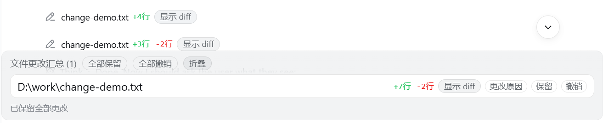
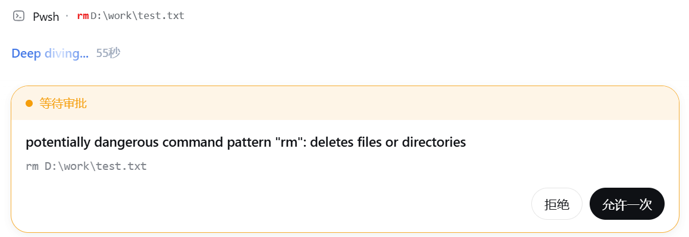

# dsh-edit-guardian

[中文](README.zh.md)

A [DeepSeek Harness](https://github.com/deepseek-ai/deepseek-harness) Web plugin that adds file-change visibility, keep/undo controls, and a command safety gate to the browser UI:

1. **File-change bar** — when the agent modifies a file through `write`, `edit`, or `str_replace_editor`, the tool row renders as `file +N lines -M lines [show diff]`. Clicking the button expands a context-aware diff inline.
2. **Change summary + keep/undo** — a persistent, collapsible summary bar above the composer lists every changed file that has not been **kept** yet, even while the agent is working. Each file has **保留** / **撤销** buttons; the header has **全部保留** and **全部撤销** (backed by the host-side `/undo` command).
3. **Dangerous-command approval + red highlight** — before `bash` / `pwsh` executes a command that matches a destructive pattern (`rm`, `Remove-Item`, `format`, `git reset --hard`, `git push --force`, `curl|sh`, …), the execution is routed through the DSH approval seam and the Web UI asks the user to approve or reject it. In the shell tool row, the matched dangerous text is highlighted in red. When a tool call requests sandbox escalation (`sandbox_permissions`), the affected path / workdir is highlighted in red with a “需要权限” badge.

## Features

### 1. File-change bar

| Tool | Behavior |
|---|---|
| `write` | Shows the created/updated file with added/removed line counts and a `show diff` toggle. |
| `edit` | While running, shows the intended change from the call arguments; once settled, shows the applied hunks from the real before/after result. |
| `str_replace_editor` | Shows the call-time diff card and keeps it visible after the result (the stock UI only shows it while running). |

Line counts are computed with a line-level diff over the per-hunk diff payloads. For very large hunks the summary falls back to an approximate count; the expanded diff is always the authoritative one.

### 2. Change summary + keep/undo

A persistent `conversation.input.dock` entry above the composer renders the summary whenever there are unkept file changes, including while the agent is still working. The header shows the file count and a collapse toggle. Each file row shows:

- openable path
- `+N行 -M行` line stats
- **显示 diff / 隐藏 diff** toggle (per file, context-aware diff)
- **保留** — marks that change as accepted and removes it from the summary
- **撤销** — runs `/undo <path>` and removes it from the summary after success

Header actions:

- **全部保留** — marks all currently listed changes as accepted
- **全部撤销** — runs `/undo --all` and clears the summary

Resolution is tracked per tool-call id, so if a file changes again after being kept, the new change reappears in the summary.

Undo is handled by the host half, which records the pre-edit `before` content of every successful `write` / `edit` result. Reverting writes the recorded `before` back to disk; files created by `write` (`before: null`) are removed. Changes made through `str_replace_editor` or shell commands are not restorable by `/undo`.

### 3. Dangerous-command approval + red highlight

The host half listens on `tools/pre-execute` and inspects `bash` / `pwsh` command strings. When a command matches a dangerous pattern, the plugin returns an `ask` decision with a human-readable reason. The DSH tool registry then resolves that decision through `ctx.approval`, so the standard Web approval prompt is shown **before anything executes**.

**Trust everything in advance** — switch the session to the `Full access` permission preset in the Web UI (`danger-full-access` sandbox mode). `dsh-edit-guardian` then lets dangerous commands through without prompting, matching DSH's existing "full access" semantics.

Fail-closed: if the user rejects, cancels, or no approval channel is available, the command does not run.

### Dangerous patterns

| Pattern | Meaning |
|---|---|
| `rm` | deletes files or directories |
| `rmdir` / `rd` | removes directories |
| `Remove-Item` | PowerShell file/directory deletion |
| `del` | Windows file deletion |
| `format` / `mkfs` / `diskpart` / `dd of=` | destructive disk/volume operations |
| `git clean` / `git reset --hard` / `git push --force` | destructive Git operations |
| `shutdown` / `reboot` / `halt` / `poweroff` / `Restart-Computer` / `Stop-Computer` | shutdown/reboot |
| `Clear-Content` | PowerShell content erasure |
| `curl\|sh` / `wget\|sh` | executes a remote script through the shell |

Patterns are simple regular expressions, so harmless commands that merely mention `rm` (for example `echo "rm -rf"`) may also prompt. This is intentional: when in doubt, ask. Use the `Full access` preset to skip prompts.

## Screenshots

| File-change summary | Dangerous-command approval |
|---|---|
|  |  |

## Installation

Install into your web profile:

```sh
# from a local checkout
dsh plugin --profile web add file:./dsh-edit-guardian

# or from a GitHub repository
dsh plugin --profile web add git+https://github.com/<your-name>/dsh-edit-guardian.git

# or, once published to npm
dsh plugin --profile web add dsh-edit-guardian
```

Then restart the web profile:

```sh
dsh --profile web
```

The plugin does not hot-reload into an already-running Web process.

Uninstall:

```sh
dsh plugin --profile web remove dsh-edit-guardian
```

## How it works

```
dsh-edit-guardian/
├── lib/
│   ├── index.js      # host half: dangerous-command gate, undo recorder, /undo command
│   └── client.js     # web client half: file rows, shell rows, change summary
├── cordis.patch.yml  # bundle patch inserting the host row
├── dsh.plugin.json   # plugin metadata
├── scripts/          # local smoke tests
│   ├── smoke-host.mjs
│   └── smoke-client.cjs
├── package.json
└── README.md / README.zh.md
```

- **Host half** — registers a `tools/pre-execute` listener. Returning `{ kind: "ask", reason }` from the waterfall short-circuits the built-in tool pipeline into `serviceAsk`, which calls `ctx.approval.request(...)`. The existing `dsh-host-apiproxy` approval answerer then shows the prompt in the browser. When the session's sandbox mode is `danger-full-access`, the listener delegates to `next()` instead of asking. It also records successful `write` / `edit` results and registers the `/undo` command.
- **Client half** — registers keyed `tool.call.toolview` entries with a negative shadowing priority:
  - `write`, `edit`, `str_replace_editor` → the compact `+N / -M [show diff]` row with a context-aware collapsible diff, and a red “需要权限” badge when the call requests `sandbox_permissions`.
  - `bash`, `pwsh` → the danger-aware shell row that highlights matched dangerous text in red, shows the requested sandbox mode + workdir in red for escalation calls, and expands to the terminal output.
  - It also registers a `conversation.input.dock` entry that renders the persistent change summary with per-file keep/undo and header keep-all/undo-all actions, plus a collapse toggle.

## Development

Smoke tests do not require a running DSH instance:

```sh
node scripts/smoke-host.mjs
node scripts/smoke-client.cjs
```

After changing source files, reinstall the local package into the profile and restart the web profile:

```sh
dsh plugin --profile web add file:./dsh-edit-guardian
dsh --profile web
```

## Publishing

### GitHub

```sh
cd dsh-edit-guardian
git init
git add .
git commit -m "dsh-edit-guardian: file-change summary with keep/undo and command safety gate"
git branch -M main
git remote add origin https://github.com/<your-name>/dsh-edit-guardian.git
git push -u origin main
```

Then add the repository topic **`dsh-plugin`** in the GitHub repo settings so DSH plugin search (`find_dsh_plugin`) can discover it.

If you publish to npm, fill in the real `"repository"` field in `package.json` first:

```sh
npm publish
```

### npm

After publishing, users can install with:

```sh
dsh plugin --profile web add dsh-edit-guardian
```

## Limitations

- Dangerous-pattern matching is regex-based and deliberately conservative; false positives are possible.
- Line counts are approximate for very large diffs.
- Undo restores files recorded from `write` / `edit` only; `str_replace_editor` and shell-command modifications are not restorable by `/undo` yet.
- Undo records are in-memory and per-session: they disappear when the web process restarts.
- The shell row for `bash` / `pwsh` is replaced by the danger-aware renderer; its collapsed summary shows the command instead of the description.
- The plugin is Web-profile oriented; headless/TUI profiles have no approval UI or toolview surface, so only the host-side gate and `/undo` are relevant there.
- Approval policy semantics are inherited from DSH: in a custom `workspace-write` + `never` approval-policy combination, `ask` decisions are rejected instead of prompting.

## License

MIT
